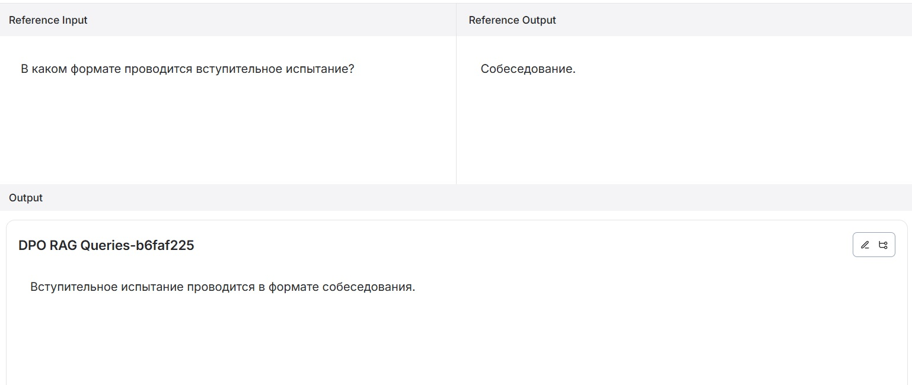

# Бот для помощи абитуриенту дополнительного образования Всероссийской академии внешней торговли

#### Команда: Лютова Дарья

Запустить и протестировать бот можно в Telegram: [**@dpo_testing_bot**](https://t.me/dpo_testing_bot) (пока реализована тестовая версия, так как документы по программам еще не все собраны деканатом; список программ расширяется).

Бот поддерживает выбор программы из списка, после чего можно задавать вопросы, связанные с выбранной программой.

Пример интерфейса:
- Кнопки выбора программы: 
- Общий вид бота: 

### Структура проекта:

1. **Документы:**
   - Все собранные документы доступны в папке [files](./files).

2. **Основные компоненты:**
   - Реализация Retrieval-Augmented Generation (RAG): [langchain_main.py](./langchain_main.py)
   - Скрипт валидации: [validation.py](./validation.py)
   - Запуск бота: [tg_bot_main.py](./tg_bot_main.py)

### Используемые технологии

#### Модель:
- **LLaMA 3.1**:
  - Контекст: 8192 токена (num_ctx=8192)
  - Параметры генерации:
    - **temperature:** 0.5 
    - **top_k:** 12 
    - **top_p:** 0.2 
    - **repeat_penalty:** 1.1

#### Компоненты:
- **LLM и Embeddings:** Ollama, OllamaEmbeddings и ChatOllama (генерация ответов и векторизация текстов).
- **Векторное хранилище:** PGVector на базе PostgreSQL.
- **Text Splitter:** RecursiveCharacterTextSplitter (разделение текста для обработки).
- **Memory и Chat History:** ConversationBufferMemory и InMemoryChatMessageHistory.
- **Prompts:** PromptTemplate (форматирование запросов).

### Результаты валидации

Пример результатов валидации и экспериментов доступен здесь:
- 

Примеры ответов бота:
- 
- 

Примечание: Код рассчитан на выполнение на сервере.

---

В случае возникновения вопросов или в случае, если бот "прилег отдохнуть", пожалуйста, свяжитесь с автором https://t.me/DariaLyutova

